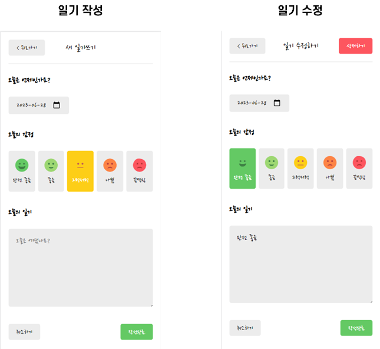

# 📙 Emotion Diary

한입 크기로 잘라먹는 리액트(React.js) 강의를 토대로 만든 감정 일기장 프로젝트입니다.

데이터는 localStorage를 이용해 일기장을 저장하는 방식을 사용했으며

react router를 사용했으며, 상태관리는 Context를 사용하여 props drilling을 방지하였습니다.

배포는 firebase를 이용해 배포를 진행했습니다.

향후 피드백을 통해 업데이트를 진행할 예정입니다.


## 🔗 정리

#### ▶ 배포 사이트 URL


https://yerm-react-diary.web.app/


#### ▶ 기술 정리

[Emotion-Diary React 기술 정리](./study/README2.md)

[React 기본 문법 정리](./react-diary/README.md)


## ✅ 새로 공부한 내용

1. [test-library/react 적용하기](https://github.com/yeafla530/jest-practice)


## ✅ how to start

> 프로젝트 구동 방법입니다

```
cd emotion-diary
npm start
```


## ✅ 기능소개

### 1️⃣ Home


#### 1. Header

* 앞 뒤 버튼 클릭 시 한달씩 날짜가 변경된다


##### 코드 설명

```jsx
const [data, setData] = useState([])
const [curDate, setCurDate] = useState(new Date())  

// 바뀐 년원에 따라 리스트 불러오기
useEffect(()=>{
    // 일기가 있으면 적용
	if (diaryList.length >= 1) {
        // 해당 월의 1일이 됨
        const firstDay = new Date(
        	curDate.getFullYear(), 
        	curDate.getMonth(),
        1).getTime();

        // 오늘 월의 마지막 날 (30/31/28일) => 시, 분, 초까지 바꿔줘야함
        const lastDay = new Date(
            curDate.getFullYear(),
            curDate.getMonth()+1,
            0,
            23, 
            59, 
            59
        ).getTime()

        // 바뀐 년월에 따라 리스트 불러오기
        setData(diaryList.filter((it) => firstDay <= it.date && it.date <= lastDay))
	}


},[diaryList, curDate]) // diaryList를 넣어주어야 일기 생성, 수정, 삭제시 다이어리 리스트도 변경됨


	// 한달씩 미래로
    const increaseMonth = () => {
        setCurDate(new Date(curDate.getFullYear(), curDate.getMonth()+1, curDate.getDate()))
    }
    // 한달씩 과거로
    const decreaseMonth = () => {
        setCurDate(new Date(curDate.getFullYear(), curDate.getMonth()-1, curDate.getDate()))
    }


return (
    // Header
    <div>
    	<MyHeader 
        headText={headText} 
        leftChild={<MyButton text={'<'} onClick={decreaseMonth}/>} 
        rightChild={<MyButton text={'>'} onClick={increaseMonth}/>}/>
    </div>
)
```


#### 2. 정렬 및 필터

#### 코드 설명

> 감정필터와 시간순 정렬을 통해 뽑아진 array를return 해준다. 

```javascript
// DiaryList정렬된 리스트 반환하는 함수
const getProcessDiaryList = () => {
    // 감정을 필터링해주는 함수
    const filterCallBack = (item)=>{
        if (emotionType === 'good') {
            return parseInt(item.emotion) <= 3
        } else {
            return parseInt(item.emotion) > 3
        }
    }
    // 최신순, 오래된순 정렬해주는 함수
    const compare = (a, b) => {
        // 최신순 정렬
        if (sortType === 'latest') {
            return parseInt(b.date) - parseInt(a.date)
        } else {
            return parseInt(a.date) - parseInt(b.date)
        }
    }

    // diaryList를 JSON화 시켜서 문자로 바꾸고 다시 JSON화 시켜줌
    const copyList = JSON.parse(JSON.stringify(diaryList))
    const filterredList = emotionType === 'all' ? copyList : copyList.filter((it)=>filterCallBack(it))
    const sortedList = filterredList.sort(compare)
    return sortedList;
}
```

> DiaryList에서 필터링된 리스트를 받아준다

```jsx
return <div className="DiaryList">
    ...
    {getProcessDiaryList().map((it)=>(
    	<DiaryItem key={it.id} {...it}/>
    ))}
</div>
```


1. 시간순 정렬 (최신순, 오래된순)

   

   * 최신순

   

   

   * 오래된 순

   

   

2. 감정 필터

   * 좋은 감정만

   

   * 안좋은 감정만

     


### 2️⃣ 일기 작성 및 수정(Create / Update)




* 날자와 감정, 글 작성 후 작성 완료
* 동일한 부분은 component 생성 (*pages/DiaryEditor*.js)
* 데이터 저장은 localStorage에 저장
* 수정 페이지에서 삭제 가능


### 3️⃣ 일기 상세 (Read)


* 감정과 글을 볼 수 있습니다
* 수정으로 바로 넘어갈 수 있습니다.


## ✅ 최적화

### 문제점

1. 날짜를 넘길때마다 select box 리렌더링 발생
2. 최신순/오래된 순 변경시 diaryItem 리렌더링 발생
3. 일기 수정 페이지 -> 내용 수정시 감정 이모지에도 리렌더링 발생


### 해결방법

1. React.memo를 사용하여 고착 컴포넌트로 만든다

   * export 에 사용시

   ```jsx
   export default React.memo(EmotionItem)
   ```

   * 함수에 사용시

   ```jsx
   // React.memo를 통해 고착 컴포넌트로 만든다
   const ControlMenu = React.memo(({value, onChange, optionList})=>{
       useEffect(()=>{
           console.log("Control Menu")
       })
       return <select className="ControlMenu" value={value} onChange={(e)=>onChange(e.target.value)}>
           {optionList.map((it, idx)=><option key={idx} value={it.value}>{it.name}</option>)}
       </select>
   })
   ```

   

2. React.memo사용시 useCallback처리도 함께 되어야하는데 useState를 이용한 set함수는 자체만으로 useCallback처리가 되기 때문에 따로 적용해주지 않아도됨

3. handle함수를 따로 만들게 되면 useCallback까지 처리해 주어야함

   ```js
   // 이처럼 사용하기 위해서는 useCallback까지 적용해주어야함
   const handleSetSortType = (sortType) => {
       setSortType(sortType)
   }
   ```

   

4. useCallback 적용

   ```js
   // 최적화4. useCallback으로 메모이제이션 진행
   // 가장 최신의 state를 받아올 필요는 없으므로
   // 함수형 업데이트는 진행하지 않는다
   // 함수형 업데이트 : setData((data) => [newItem, ...data]);
   const handleClickEmote = useCallback((emotion) => {
   	setEmotion(emotion)
   }, [])
   ```

   * cf) 함수형 업데이트 : 값을 전달하지 않고 함수를 전달

     data의 현재값을 참조할 수 있도록 하여 항상 최신의 state를 참조할 수 있도록 도와줌

     ```
     const onCreate = useCallback(
       (author, contents, emotion) => {
         const created_date = new Date().getTime();
         const newItem = {
           author,
           contents,
           emotion,
           created_date,
           id: dataId.current,
         };
         dataId.current += 1;
         // 함수형 업데이트
         setData([newItem, ...data]);
       },
       [data]
     );
     ```


## ✅build 및 배포

* build 명령어

  ```
  npm run build
  npm install -g serve
  serve -s build
  ```

  


### 🦊 firebase를 이용한 배포

* 배포 과정 (명령 프롬프트)

  1. Firebase CLI 설치

     ```
     npm install -g firebase-tools
     ```

  2. 프로젝트 초기화

     ```
     firebase login
     
     firebase init
     ```

  3. 배포

     ```
     firebase deploy --only hosting
     ```

     