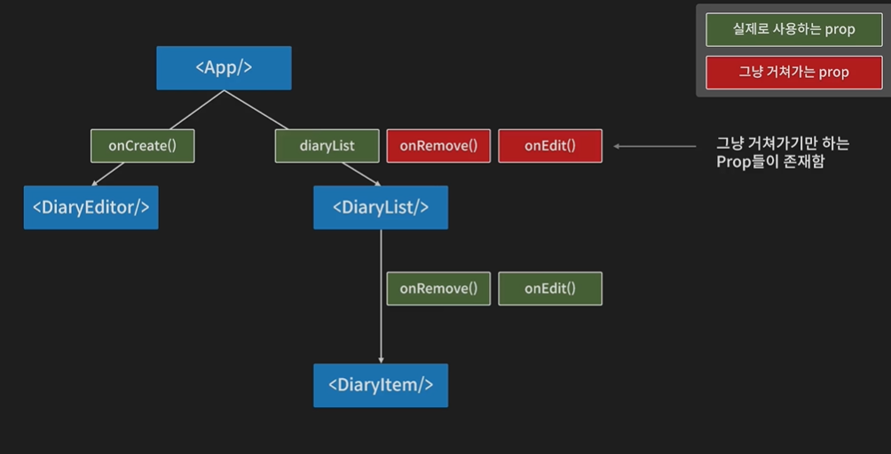
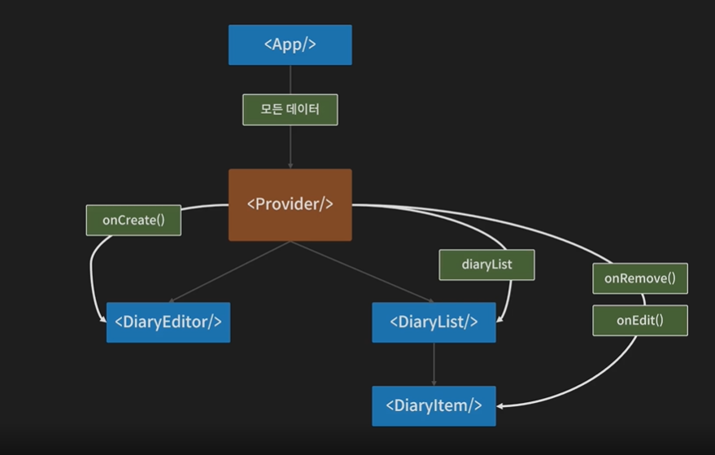
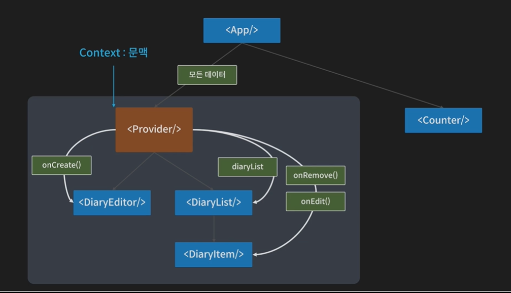

# 📍 React

## React 사용하는 이유

1. 공통요소 : 컴포넌트 화 방식

   - React는 Component 기반의 UI 라이브러리다

   - 공통적으로 사용될 것으로 예상되는 것들을 컴포넌트로 묶어 사용

   - 유지보수, 재사용 용이

   - Shotgun Surgery : 중복 코드 삭제

2. 선언형 프로그래밍

   - 목적을 바로 말하는 프로그래밍
   - 명령형 프로그래밍 : 절차를 하나하나 다 나열해야함 (jquery)

3. Virtual DOM
   - DOM(Document Object Model)이란 문서 객체 모델
   - 잦은 업데이트 상황에서는 브라우저는 필요이상의 연산을 해야되고 성능저하로 이어짐
   - 가상 돔을 사용함으로써 발생하는 변화를 가상돔에 미리 업데이트 시키고 (화면에 그리지 않음) 한번에 업데이트 시킴
     - State Change > Compute Diff(업데이트 상황) > Re-render
     - Compute Diff과정이 Browser DOM과 Virtual DOM의 차이점


## Get Started

```
cd react-diary
npm start
```


## document structure

```
ㄴ node_modules : node.js 구성요소중 하나로 외부 모듈을 저장하고 있는 폴더
ㄴ public
	ㄴ fabicon.ico : 웹사이트 아이콘
	ㄴ index.html : 전체 html 코드
	ㄴ manifest.json : 홈화면에 추가 같은 아이콘 설정
	ㄴ robots.txt : 검색 엔진 수집 설정
ㄴ src
	ㄴ App.css : style 파일
	ㄴ App.js : 컴포넌트, jsx문법 사용
	ㄴ package-lock.json : node_modules에 있는 목록이 작성되어있음
	ㄴ package.json : node_modules에 있는 목록이 작성되어있음

```


## es module system

> `export default App`
>
> => 다른 파일에서 `import name from '경로'`로 사용할 수 있음


## useEffect

> class형에서 사용할 수 있었던 lifecycle을 hook을 통해 함수형 코드에서도 작성할 수 있게 됐다 (useEffect)

1. mount

   > 의존성 배열 ㅣ 배열 내 들어가있는값이 변화하면 콜백함수가 수행됨

   ```
   useEffect(()=>{
   	// todo
   	mount될 때 실행시킬 함수
   },[]) // 의존성배열
   ```

2. update

   ```
   useEffect(()=>{
   	// todo
   	update될 때 실행시킬 함수
   })
   ```

3. unmount

   ```
   useEffect(()=>{
   	return () => {
   		// todo
   		unmount될 때 실행시킬 함수
   	}
   },[])
   ```


## React.memo

> 함수형 컴포넌트에 업데이트 조건 걸어줌
>
> React.memo는 고차컴포넌트(HOC)이다

- 같은 props를 받으면 rerendering하지 않는 강화된 component를 돌려준다

```
const MyComponent = React.memo(function MyComponent(props) {
  /* props를 사용하여 렌더링 */
});
```


### example

1. React.memo 적용 x
   - 둘중에 하나라도 변화하면 둘다 rerendering됨

```js
// 둘중에 하나라도 변화하면 둘다 rerendering됨
const TextView = ({ text }) => {
  useEffect(() => {
    console.log(`UseEffect :: Text : ${text}`);
  });
  return <div>{text}</div>;
};

const CountView = ({ count }) => {
  useEffect(() => {
    console.log(`UseEffect :: Count : ${count}`);
  });
  return <div>{count}</div>;
};
```

2. React.memo 적용
   - 각각 text나 count가 바뀔때만 작동됨

```js
const TextView = React.memo(({ text }) => {
  useEffect(() => {
    console.log(`UseEffect :: Text : ${text}`);
  });
  return <div>{text}</div>;
});

const CountView = React.memo(({ count }) => {
  useEffect(() => {
    console.log(`UseEffect :: Count : ${count}`);
  });
  return <div>{count}</div>;
});
```

3. object의 얕은 비교

```js
const CounterA = React.memo(({ count }) => {
  useEffect(() => {
    console.log(`Counter A Update: ${count}`);
  });
  return <div>{count}</div>;
});

const CounterB = React.memo(({ obj }) => {
  // 객체는 얕은 비교 > 주소를 비교
  useEffect(() => {
    console.log(`Counter B Update: ${obj.count}`);
  });

  return <div>{obj.count}</div>;
});

const OptimizeTest = () => {
  const [count, setCount] = useState(1);
  const [obj, setObj] = useState({
    count: 1,
  });

  return (
    <div style={{ padding: 50 }}>
      <div>
        <h2>counter A</h2>
        <CounterA count={count} />
        {/* 상태가 바뀌진 않음 */}
        <button onClick={() => setCount(count)}>A Button</button>
      </div>
      <div>
        <h2>Counter B</h2>
        <CounterB obj={obj} />
        {/* count가 변경되지 않았는데 rerender됨 */}
        {/* 얕은 비교를  했기 때문에 주소가 변경됨*/}
        <button
          onClick={() =>
            setObj({
              count: obj.count,
            })
          }
        >
          B button
        </button>
      </div>
    </div>
  );
};
```

4. React.memo의 areEqual
   - next Props와 pre Props가 동일한 값을 가지면 True, 아니면 False
   - React.memo에서 areEqual의 값이 true면 rerendering하지 않음

```js
function MyComponent(props) {
  /* props를 사용하여 렌더링 */
}
function areEqual(prevProps, nextProps) {
  /*
  nextProps가 prevProps와 동일한 값을 가지면 true를 반환하고, 그렇지 않다면 false를 반환
  */
}
export default React.memo(MyComponent, areEqual);
```

```javascript
const CounterB = ({ obj }) => {
  // 객체는 얕은 비교 > 주소를 비교
  useEffect(() => {
    console.log(`Counter B Update: ${obj.count}`);
  });

  return <div>{obj.count}</div>;
};

const areEqual = (prevProps, nextProps) => {
  // if (prevProps.obj.count === nextProps.obj.count) {
  //     return true // 이전 프롭스 현재 프롭스가 같다 => 리렌더를 일으키지 않음
  // }
  // return false // rerender를 일으켜라

  return prevProps.obj.count === nextProps.obj.count;
};

const MemoizedCounterB = React.memo(CounterB, areEqual);

const OptimizeTest = () => {
  const [obj, setObj] = useState({
    count: 1,
  });

  return (
    <div style={{ padding: 50 }}>
      <div>
        <h2>Counter B</h2>
        // 얕은 복사일때는 rerendering되지 않음
        <MemoizedCounterB obj={obj} />
        <button
          onClick={() =>
            setObj({
              count: obj.count,
            })
          }
        >
          B button
        </button>
      </div>
    </div>
  );
};
```


## 컴포넌트 최적화 : useCallBack

> 메모이제이션된 콜백을 반환한다
>
> 어려운 개념이었다,,

### 최적화 문제 고찰

1. DiaryList에서 삭제 누를 시 DiaryEditor Component도 같이 rerendering됨


2. 삭제를 누른다고 DiaryEditor까지 rerendering되는 것은 불필요
3. 불필요한 렌더링 방지위해 useCallback사용


### useCallback

> `useCallback(fn, deps)`는 `useMemo(()=>fn, deps)`와 같다
>
> 값을 반환하는게 아닌 메모이제이션된 callback함수를 반환

```js
const memoizedCallback = useCallback(
  () => {
    doSomething(a, b);
  },
  [a, b] // dependency array => a, b의 값이 변화해야만 출력됨
);
```

- 함수를 재생성함
- [] : depth, 빈 배열이면 mount되는 시점에 한번만 실행됨


### 해결방법

1. DiaryEditor Component를 React.memo로 감싸주어 변화가 있을 때만 render하도록 바꿈
2. App.js에서 새로고침 했을 때 DiaryEditor에서 Rerender가 2번 일어남
   - App.js에서 data의 초기값 []
   - mount되는 시점에서 초기화 작업 일어남 (initData) => setData에 전달되면서 렌더링 일어남
   - DiaryEditor에 전달되는 onCreate함수가 2번 생성되어 전달됨
3. DiaryEditor로 전달되는 onCreate함수 useCallback으로 감싸줌
4. deps는 빈배열로 전달하여 mount되는 시점에 한번만 작동되도록 해줌, 그 다음엔 첫번째 함수를 계속 재사용할 수 있도록 만듦

```js
const onCreate = useCallback((author, contents, emotion) => {
  const created_date = new Date().getTime();
  const newItem = {
    author,
    contents,
    emotion,
    created_date,
    id: dataId.current,
  };
  dataId.current += 1;
  setData([newItem, ...data]);
}, []);
```


### 문제점1

> 일기 생성 시 20개의 일기가 사라지고 생성한 1개의 일기만 남는 오류가 발생


#### 원인

- onCreate에 deps를 빈배열로 설정했기 때문
- mount했을 때의 배열은 빈배열,,! data의 마지막이 []이기 때문에 1개만 생성된 것
- 함수는 컴포넌트가 재생성될 때 다시 생성되는 이유가 있음
  - 현재 state값을 참조할 수 있어야하기 때문에


#### 해결방법1

- deps에 data를 넣어준다

```js
const onCreate = useCallback(
  (author, contents, emotion) => {
    const created_date = new Date().getTime();
    const newItem = {
      author,
      contents,
      emotion,
      created_date,
      id: dataId.current,
    };
    dataId.current += 1;
    setData([newItem, ...data]);
  },
  [data]
);
```

**문제점** | data가 변화할 때마다 작동되므로 우리가 원하는 동작이 이뤄질 수 없음

**우리가 원하는 동작** | data가 변화해도 onCreate함수가 생성되지 않도록 하기


#### 해결방법2

- 함수형 업데이트 진행
- setData에 값이 아닌 함수를 전달
- 항상 최신의 state를 인자를 통해 전달받게 되면서 deps를 비울 수 있도록 도와줌

```js
const onCreate = useCallback((author, contents, emotion) => {
  const created_date = new Date().getTime();
  const newItem = {
    author,
    contents,
    emotion,
    created_date,
    id: dataId.current,
  };
  dataId.current += 1;
  // 함수형 업데이트
  setData((data) => [newItem, ...data]);
}, []);
```


## useReducer

> 컴포넌트에서 상태변화 로직 분리
>
> 복잡한 상태변화 로직을 컴포넌트 밖에서 관리할 수 있도록 함

```js
const [count, dispatch] = useReducer(reducer, 1)
const reducer = (state, action) => {
	switch (action.type) {
		case 1:
			return state + 1
		default:
			return state
	}
}

return() {
	<div>
		{count}
		<button onClick={() => dispatch({type : 1})}>add 1</button>
	<div>
}
```

- count : 상태
- dispatch : 상태 변화 함수, 상태 변화를 일으킴
- reducer : 상태변화 처리함수
- 1: count의 초기값
- (state, action) : state - 가장 최신 state, action : 액션 객체의 값
- {type : 1}: 액션 객체 = 상태 변화

### 특징

- 함수형 업데이트 필요 없이 호출하면 알아서 현재 state를 reducer함수가 참조해서 변경해준다
  - dipendency array 신경 안써도 된다


## Context

> 컴포넌트 트리에 데이터 공급하기
>
> props drilling 문제 해결

[한입 크기로 잘라먹는 리액트 중]



[Context 적용]



1. 모든 데이터를 같은 component
2. 공급자 역할을 하는 Provider에 data 넘김
3. Provider 자손에 해당하는 모든 Component에 직통으로 데이터를 줄 수 있음
4. Provider 자식 컴포넌트들은 직통으로 data를 전달받음

**=> Props Drilling 문제 해결**




### 사용 방법

**App.js**

```js
// Context 생성
const MyContext = React.createContext(defaultValue)

// Context Provider를 통한 데이터 공급
<MyContext.Provider value={전역으로 전달하고자하는 값}>
	{/*이 Context안에 위치할 자식 컴포넌트들*/}
</MyContext.Provider>
```

**자식 component.js**

```js
import { DiaryStateContext } from "./App";

const value = useContext(MyContext);
```


### 문제점

- state변화 함수들을 value에 그냥 전달해주면 될 것 같지만 Context도 component이기 때문에 **prop이 바뀌게 되면 rerendering된다. 하위 요소들도 함께 rerendering됨**
  - 최적화가 다 풀리게 됨


### 해결방법 : Context를 중첩으로 사용한다

1. state Provider와 dispatch Provider를 따로 두어 중첩으로 사용해준다

2. DiaryStateContext의 Provider의 props인 data가 변경될 때마다 rerendering진행된다.

3. DiaryDispatchContext를 중첩으로 두어 onCreate, onRemove, onEdit은 따로 전달해준다
4. data와 dispatch를 따로 전달하여 Provider를 중첩으로 두게 될 경우 data가 변경되어도 onCreate, onRemove, onEdit에 대한 하위 Provider에는 변동이 없어 최적화를 유지할 수 있다

```
export const DiaryStateContext = React.createContext();
export const DiaryDispatchContext = React.createContext();

// useMemo사용
const memoizedDispatches = useMemo(() => {
	return {onCreate, onRemove, onEdit}
}, [])

return(
<DiaryStateContext.Provider value={data}>
    {/* dispatch Provider */}
    <DiaryDispatchContext.Provider value={memoizedDispatches}>
        <div className="App">
            <DiaryEditor />
            <div>전체일기 : {data.length}</div>
            <div>기분 좋은 일기 개수 : {goodCount}</div>
            <div>기분 나쁜 일기 개수 : {badCount}</div>
            <div>기분 좋은 일기 비율 : {goodRatio}</div>
            <DiaryList/>
        </div>
    </DiaryDispatchContext.Provider>
</DiaryStateContext.Provider>
)
```


### 의문점 : Context API와 Redux의 차이점은?

https://sewonzzang.tistory.com/53의 글을 참고하여 간단하게 정리해봤습니다

1. 미들웨어
   - 리덕스로 상태관리 시 리듀서 함수를 사용한다
   - 리덕스의 미들웨어를 사용하면 액션 객체가 리듀서에서 처리되기 전에 우리가 원하는 작업을 수행할 수 있다
   - 미들웨어는 주로 비덩기 작업 처리시 많이 사용된다
2. Hooks
   - Context API를 사용할 땐 커스텀 Hook을 만들어 사용해야하는데 리덕스에는 여러 기능이 존재한다
   - connect 함수 사용하면 useSelector, useDispatch, useStore같은 Hooks를 사용하면 쉽게 상태 조회, 액션을 디스패치 할 수 있다
   - connect함수와 useSelector함수를 사용하면 실제 상태가 바뀔 때만 컴포넌트가 리랜더링됨
   - 반면 Context는 Context가 지니고 있는 상태가 바뀌면 해당 Context의 Provider내부 컴포넌트들이 모두 리렌더링 된다
3. 상태
   - Context사용해서 글로벌 상태를 관리할 땐 기능별로 Context를 만들어 사용한다
   - 리덕스는 모든 글로벌 상태를 하나의 커다란 상태 객체에 넣어 사용하여 간편하다
