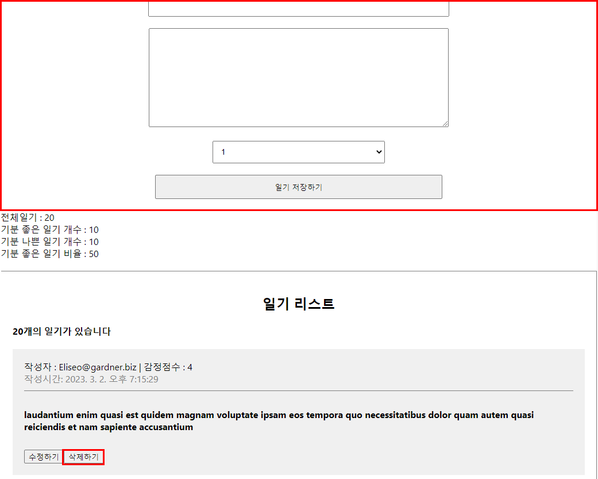
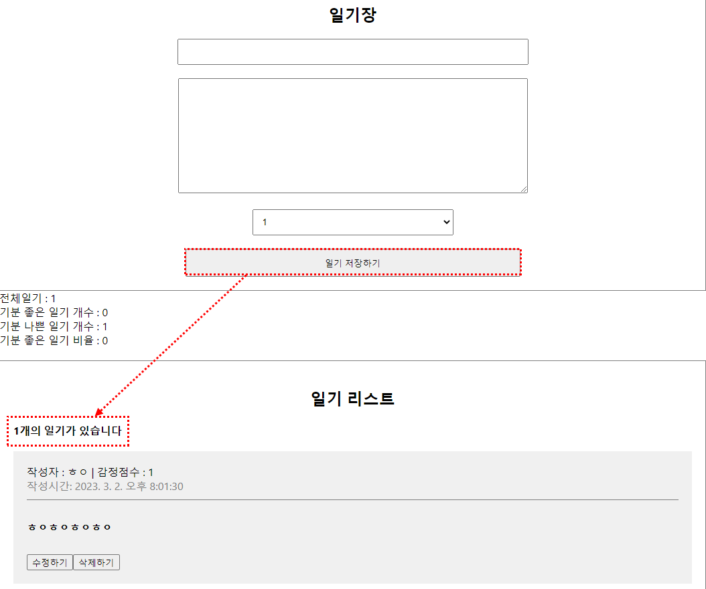

# 📍 React

## React 사용하는 이유

1. 공통요소 : 컴포넌트 화 방식

   * React는 Component 기반의 UI 라이브러리다

   * 공통적으로 사용될 것으로 예상되는 것들을 컴포넌트로 묶어 사용

   * 유지보수, 재사용 용이

   * Shotgun Surgery : 중복 코드 삭제

     

2.  선언형 프로그래밍

   * 목적을 바로 말하는 프로그래밍
   * 명령형 프로그래밍 : 절차를 하나하나 다 나열해야함 (jquery)


3. Virtual DOM
   * DOM(Document Object Model)이란 문서 객체 모델
   * 잦은 업데이트 상황에서는 브라우저는 필요이상의 연산을 해야되고 성능저하로 이어짐
   * 가상 돔을 사용함으로써 발생하는 변화를 가상돔에 미리 업데이트 시키고 (화면에 그리지 않음) 한번에 업데이트 시킴
     * State Change > Compute Diff(업데이트 상황) > Re-render
     * Compute Diff과정이 Browser DOM과 Virtual DOM의 차이점


## Get Started

```
cd reactexam
npm start
```


## document structure

```
ㄴ node_modules : node.js 구성요소중 하나로 외부 모듈을 저장하고 있는 폴더
ㄴ public
	ㄴ fabicon.ico : 웹사이트 아이콘
	ㄴ index.html : 전체 html 코드
	ㄴ manifest.json : 홈화면에 추가 같은 아이콘 설정
	ㄴ robots.txt : 검색 엔진 수집 설정
ㄴ src
	ㄴ App.css : style 파일
	ㄴ App.js : 컴포넌트, jsx문법 사용
	ㄴ package-lock.json : node_modules에 있는 목록이 작성되어있음
	ㄴ package.json : node_modules에 있는 목록이 작성되어있음
	
```


## es module system

> `export default App`
>
> => 다른 파일에서 `import name from '경로'`로 사용할 수 있음


## useEffect

> class형에서 사용할 수 있었던 lifecycle을 hook을 통해  함수형 코드에서도 작성할 수 있게 됐다 (useEffect)


1. mount

   > 의존성 배열 ㅣ 배열 내 들어가있는값이 변화하면 콜백함수가 수행됨

   ```
   useEffect(()=>{
   	// todo
   	mount될 때 실행시킬 함수
   },[]) // 의존성배열
   ```

   

2. update

   ```
   useEffect(()=>{
   	// todo
   	update될 때 실행시킬 함수
   })
   ```

   

3. unmount

   ```
   useEffect(()=>{
   	return () => {
   		// todo
   		unmount될 때 실행시킬 함수
   	}
   },[])
   ```

   

## React.memo

> 함수형 컴포넌트에 업데이트 조건 걸어줌
>
> React.memo는 고차컴포넌트(HOC)이다

* 같은 props를 받으면 rerendering하지 않는 강화된 component를 돌려준다

```
const MyComponent = React.memo(function MyComponent(props) {
  /* props를 사용하여 렌더링 */
});
```


### example

1. React.memo 적용 x
   * 둘중에 하나라도 변화하면 둘다 rerendering됨

```js
// 둘중에 하나라도 변화하면 둘다 rerendering됨
const TextView = ({text}) => {
    useEffect(()=>{
        console.log(`UseEffect :: Text : ${text}`)
    })
    return <div>{text}</div>
}

const CountView = ({count}) => {
    useEffect(()=>{
        console.log(`UseEffect :: Count : ${count}`)
    })
    return <div>{count}</div>
}

```

2. React.memo 적용
   * 각각 text나 count가 바뀔때만 작동됨 

```js
const TextView = React.memo(({text}) => {
    useEffect(()=>{
        console.log(`UseEffect :: Text : ${text}`)
    })
    return <div>{text}</div>
})

const CountView = React.memo(({count}) => {
    useEffect(()=>{
        console.log(`UseEffect :: Count : ${count}`)
    })
    return <div>{count}</div>
})
```

3. object의 얕은 비교

```js
const CounterA = React.memo(({count}) => {

    useEffect(() => {
        console.log(`Counter A Update: ${count}`)
    })
    return <div>{count}</div>
})

const CounterB = React.memo(({obj}) => {
    // 객체는 얕은 비교 > 주소를 비교
    useEffect(() => {
        console.log(`Counter B Update: ${obj.count}`)
    })

    return <div>{obj.count}</div>
})

const OptimizeTest = () => {

    const [count, setCount] = useState(1)
    const [obj, setObj] = useState({
        count: 1,
    })

    return <div style={{padding: 50}}>
        <div>
            <h2>counter A</h2>
            <CounterA count={count}/>    
            {/* 상태가 바뀌진 않음 */}
            <button onClick={() => setCount(count)}>A Button</button>
        </div>
        <div>
            <h2>Counter B</h2>
            <CounterB obj={obj}/>
            {/* count가 변경되지 않았는데 rerender됨 */}
			{/* 얕은 비교를  했기 때문에 주소가 변경됨*/}
            <button onClick={()=>setObj({
                count: obj.count
            })}>B button</button>
        </div>
    </div>
}
```

4. React.memo의 areEqual
   * next Props와 pre Props가 동일한 값을 가지면 True, 아니면 False
   * React.memo에서 areEqual의 값이 true면 rerendering하지 않음

```js
function MyComponent(props) {
  /* props를 사용하여 렌더링 */
}
function areEqual(prevProps, nextProps) {
  /*
  nextProps가 prevProps와 동일한 값을 가지면 true를 반환하고, 그렇지 않다면 false를 반환
  */
}
export default React.memo(MyComponent, areEqual);
```


```javascript
const CounterB = ({obj}) => {
    // 객체는 얕은 비교 > 주소를 비교
    useEffect(() => {
        console.log(`Counter B Update: ${obj.count}`)
    })

    return <div>{obj.count}</div>
}

const areEqual = (prevProps, nextProps) => {
    // if (prevProps.obj.count === nextProps.obj.count) {
    //     return true // 이전 프롭스 현재 프롭스가 같다 => 리렌더를 일으키지 않음
    // }
    // return false // rerender를 일으켜라

    return prevProps.obj.count === nextProps.obj.count
}

const MemoizedCounterB = React.memo(CounterB, areEqual)


const OptimizeTest = () => {

    const [obj, setObj] = useState({
        count: 1,
    })

    return <div style={{padding: 50}}>
       
        <div>
            <h2>Counter B</h2>
            // 얕은 복사일때는 rerendering되지 않음
            <MemoizedCounterB obj={obj}/>
            <button onClick={()=>setObj({
                count: obj.count
            })}>B button</button>
        </div>
    </div>
}
```


## 컴포넌트 최적화 : useCallBack

> 메모이제이션된 콜백을 반환한다
>
> 어려운 개념이었다,,


### 최적화 문제 고찰

1. DiaryList에서 삭제 누를 시 DiaryEditor Component도 같이 rerendering됨



2. 삭제를 누른다고 DiaryEditor까지 rerendering되는 것은 불필요
3. 불필요한 렌더링 방지위해 useCallback사용


### useCallback

> `useCallback(fn, deps)`는 `useMemo(()=>fn, deps)`와 같다
>
> 값을 반환하는게 아닌 메모이제이션된 callback함수를 반환

```js
const memoizedCallback = useCallback(
  () => {
    doSomething(a, b);
  },
  [a, b], // dependency array => a, b의 값이 변화해야만 출력됨
);
```

* 함수를 재생성함
* [] : depth, 빈 배열이면 mount되는 시점에 한번만 실행됨


### 해결방법

1. DiaryEditor Component를 React.memo로 감싸주어 변화가 있을 때만 render하도록 바꿈
2. App.js에서 새로고침 했을 때 DiaryEditor에서 Rerender가 2번 일어남
   * App.js에서 data의 초기값 []
   * mount되는 시점에서 초기화 작업 일어남 (initData) => setData에 전달되면서 렌더링 일어남
   * DiaryEditor에 전달되는 onCreate함수가 2번 생성되어 전달됨
3. DiaryEditor로 전달되는 onCreate함수 useCallback으로 감싸줌
4. deps는 빈배열로 전달하여 mount되는 시점에 한번만 작동되도록 해줌, 그 다음엔 첫번째 함수를 계속 재사용할 수 있도록 만듦

```js
const onCreate = useCallback((author, contents, emotion) => {
    const created_date = new Date().getTime()
    const newItem = {
      author,
      contents,
      emotion,
      created_date,
      id: dataId.current
    }
    dataId.current += 1
    setData([newItem, ...data])
}, [] ) 
```


### 문제점1

>  일기 생성 시 20개의 일기가 사라지고 생성한 1개의 일기만 남는 오류가 발생




#### 원인

* onCreate에 deps를 빈배열로 설정했기 때문
* mount했을 때의 배열은 빈배열,,! data의 마지막이 []이기 때문에 1개만 생성된 것
* 함수는 컴포넌트가 재생성될 때 다시 생성되는 이유가 있음 
  * 현재 state값을 참조할 수 있어야하기 때문에 


#### 해결방법1

* deps에 data를 넣어준다

```js
const onCreate = useCallback((author, contents, emotion) => {
    const created_date = new Date().getTime()
    const newItem = {
      author,
      contents,
      emotion,
      created_date,
      id: dataId.current
    }
    dataId.current += 1
    setData([newItem, ...data])
}, [data] ) 
```

**문제점** | data가 변화할 때마다 작동되므로 우리가 원하는 동작이 이뤄질 수 없음

**우리가 원하는 동작** | data가 변화해도 onCreate함수가 생성되지 않도록 하기


#### 해결방법2

* 함수형 업데이트 진행
* setData에 값이 아닌 함수를 전달
* 항상 최신의 state를 인자를 통해 전달받게 되면서 deps를 비울 수 있도록 도와줌

```js
const onCreate = useCallback((author, contents, emotion) => {
    const created_date = new Date().getTime()
    const newItem = {
      author,
      contents,
      emotion,
      created_date,
      id: dataId.current
    }
    dataId.current += 1
    // 함수형 업데이트
    setData((data)=>[newItem, ...data])
}, [] ) 
```

