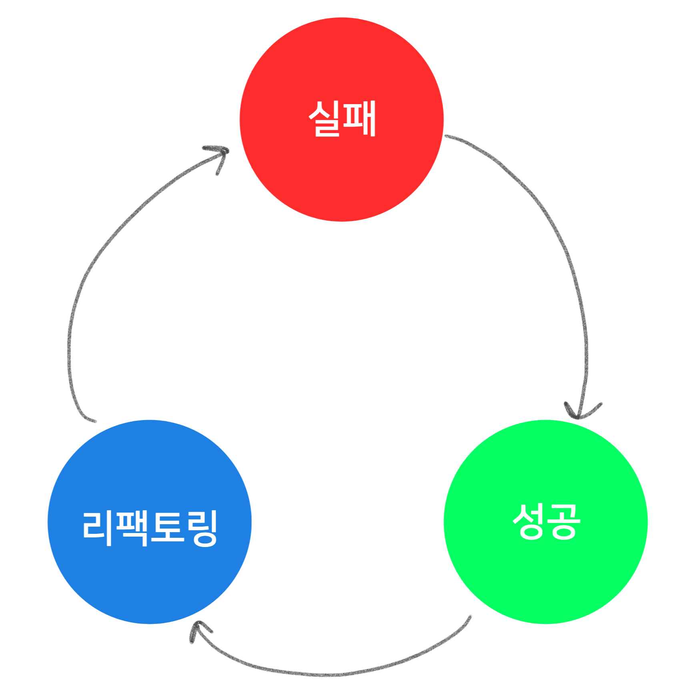
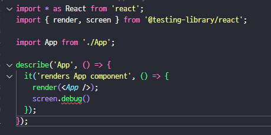

# JEST 적용하기


## ✅ Get Start

* install

```bash
-- jest 설치
npm install --save-dev jest

-- babel 관련 모듈 설치
npm install --save-dev babel-jest @babel/core @babel/preset-env @babel/preset-react

-- .ts,.tsx 파일을 트랜스파일 해주는 babel plugin
npm install --save-dev @babel/preset-typescript
```

* babel.config.js

```
module.exports = {
  presets: [
    ["@babel/preset-env", { targets: { node: "current" } }],
    "@babel/preset-typescript",
    ["@babel/preset-react", { runtime: "automatic" }],
  ],
};
```

* **typeChecking 기능 관련 모듈 설치**
  * `ts-jest`를 이용하여 typeChecking 기능을 사용하려면 jest configuration를 정의해주어야 한다.

```
npm install --save-dev ts-jest
```

* **Jest 관련 Type 정의 모듈 설치**

```
-- test 파일에서 사용되는 jest 관련 Type이 정의되어있다
npm install --save-dev @types/jest

-- 스냅샷 테스트를 도와주는 react-test-renderer 
npm install --save-dev react-test-renderer

-- jest-environment-jsdom
npm install --save-dev jest-environment-jsdom
```

* Jest's configuration 정의하기
  * React 에서 진행되는 Test 는 Node환경이 아닌 브라우저 환경에서도 Test 할 수 있어야 한다. 따라서 `package.json` 안에 `jest:{}` 필드를 삽입하거나, `jest.config.js`를 만들어서 테스트 환경을 `Node`로 할것인지 `jsdom`으로 할것인지 정의해야한다.

```json
{
  ...
  "devDependencies": {
    ...
  },
  "dependencies": {
    ...
  },
  "jest" : {                    // 이 부분
    "testEnvironment": "jsdom"  // Default : "node"
  }                             //
}
```

* test scripts 정의

```json
// package.json
{
    "scripts" : {                    
        "test": "jest --watchAll --verbose"
	}
}
```

* @testing-library/react 설치

```
npm install --save-dev @testing-library/react
```

* download vscode "Jest" extension 


#### 설치 요약

```
npm install --save-dev jest babel-jest @babel/core @babel/preset-env @babel/preset-react @babel/preset-typescript ts-jest @types/jest react-test-renderer jest-environment-jsdom @testing-library/react @testing-library/jest-dom
```


## ✅ jest 기본 개념

### 기본 구조

`sum.js`

```js
function sum(a, b) {
  return a + b;
}

module.exports = sum; // 내보내기
```


`sum.test.js`

* test: 새로운 테스트 케이스 만드는 함수
* expect : 특정 값이 ~~일 것이다 사전에 정의 하고 통과하면 테스트 성공시키고 통과하지 않으면 테스트 실패시킴
* toBe : matchers라고 부르는 함수, 

```js
const sum = require('./sum');

test('1 + 2 = 3', () => {
  expect(sum(1, 2)).toBe(3);
});
```


`실행결과`

```bash
$ npm test

> test
> jest

 PASS  ./sum.test.js
  √ 1+2=3 (20 ms)

Test Suites: 1 passed, 1 total
Tests:       1 passed, 1 total
Snapshots:   0 total
Time:        4.555 s
Ran all test suites.
```


### test 대신 it

test대신 it라는 키워드를 사용하게 되면 테스트케이스 설명을 영어로 작성하게 되는 경우 "말이 되게" 작성할 수 있다.

한국어로 작성하는것도 가능하다

```js
const sum = require('./sum')

// test('1+2=3', () => {
//     expect(sum(1, 2)).toBe(3)
// })

it('calculates 1 + 2', () => {
    expect(sum(1, 2)).toBe(3)
})

```


### describe

> 여러개의 테스트케이스를 묶을수 있음

`sum.js`

```
function sum(a, b) {
    return a + b
}

function sumOf(numbers) {
    let result = 0
    numbers.forEach(n => {
        result += n
    })
    return result
}

// 각각 내보내기
exports.sum = sum
exports.sumOf = sumOf
```


`sum.test.js`

```
const {sum, sumOf} = require('./sum')

describe('sum', ()=> {
	it('calc 1 + 2', () => {
		expect(sum(1, 2)).toBe(3)
	})
	
	it('calc all numbers', () => {
		let array = [1, 2, 3, 4, 5]
		expect(sumOf(array)).toBe(15)
	})
})
```


## ✅TDD

> Test Driven Development : 테스트 주도 개발



* 선 테스트코드 작성 후 구현


### 실패

* 첫번째 절차
* 프로젝트의 전체 기능에 대해 처음부터 모든 테스트케이스를 만드는 것이 아니라, 지금 가장 먼저 구현할 기능 하나씩 테스트 케이스를 작성한다
* 상황에 따라서 한꺼번에 여러 테스트케이스를 먼저 작성하기도함


### 성공

* 우리가 작성하는 실패하는 테스트케이스를 통과시키기 위해 코드를 작성해 테스트 통과시키기


### 리팩토링

* 우리가 구현한 코드에 중복되는 코드가 있거나 더 개선시킬 방법이 있다면 리팩토링 진행
* 리팩토링 진행하고 나서도 TC가 성공하는지 확인
* 절차가 끝나면 다시 처음 절차로 돌아가서 실패하는 TC를 작성


### 장점

1. 테스트 케이스를 작성할 때 주로 작은 단위로 만들기 때문에 코드 작성할 때 코드가 방대해지지 않고 코드의 모듈화가 자연스럽게 이루어면서 개발이 진행됨
2. 테스트 커버리지가 높아짐 => 리팩토링도 쉬워지고 유지보수도 쉬워짐 => 프로젝트의 퀄리티가 높아짐
3. 협업에도 도움이됨
4. 버그에 낭비하는 시간도 최소한으로 할 수 있으며 구현한 기능이 요구사항을 충족하는지 쉽게 확인 가능


## 예시

`stats.ts`

```ts
// 최대값
export const max = (numbers: number[]): number => Math.max(...numbers)
// 최소값
export const min = (numbers: number[]): number => Math.min(...numbers)
// 평균값
export const avg = (numbers: number[]): number => {
    return numbers.reduce((acc:number, cur: number, index: number, {length}) => acc + cur / length, 0) 
}
// 정렬
export const sort = (numbers: number[]): number[] => {
    return numbers.sort((a, b) => a - b)
}
// 중앙값
export const median = (numbers: number[]): number => {
    const {length} = numbers
    const middle = Math.floor(length / 2)
    return length % 2 ? numbers[middle] : (numbers[middle - 1] + numbers[middle]) / 2
}
```


`stats.test.js`

```js
const stats = require('./stats')
//test
describe('stats', () => {
    it('최댓값 찾기', () => {
        expect(stats.max([1, 2, 3, 4])).toBe(4);
    })

    it('최솟값 찾기', () => {
        expect(stats.min([1, 2, 3, 4])).toBe(1)
    })

    it('평균값 찾기', () => {
        expect(stats.avg([1, 2, 3, 4, 5])).toBe(3)
    })

    // toEqual : 객체 또는 배열을 비교할 때 사용
    describe('median', () => {
        it('정렬하기', () => {
            expect(stats.sort([5, 4, 1, 2, 3])).toEqual([1, 2, 3, 4, 5])
        })
        it('홀수 길이의 중앙값', () => {
            expect(stats.median([1, 2, 3, 4, 5])).toBe(3)
        })
        it('짝수 길이의 중앙값', () => {
            expect(stats.median([1, 2, 3, 4, 5, 6])).toBe(3.5)
        }) 
    })
})
```


## ✅ react-test-library

### 특징

1. 렌더링 결과에 집중
2. 실제 DOM에 대해 신경을 많이 쓰고 컴포넌트의 인스턴스에 대해 신경쓰지 않고, 실제 화면에 무엇이 보여지는지, 어떤 이벤트가 발생했을 때 화면에 원하는 변화가 생겼는지 이런것을 확인하기에 더 최적화 되어 있음
3. jest-dom을 이용해 DOM에 관련된 `matcher`를 추가해줌
4. react 공식문서에서도 추천하는 testing방법
5. react-test-library 모듈이 @testing-library/react로 옮겨짐


### react 폴더 생성

```
-- create react app 
npx create-react-app rtl-tutorial
npm install @testing-library/any-framework
```


### 예시


### 에러 수정

#### 문제1. debug 

* Unexpected debug statement



#### 원인

참고 자료: [no-debugging-utils](https://github.com/testing-library/eslint-plugin-testing-library/blob/main/docs/rules/no-debugging-utils.md)

console.log 문이 브라우저의 출력을 오염시키는 것처럼 debug도 push되어서는 안된다

아래 코드들은 push되어선 안되기 때문에 red line이 쳐진 것. 주석처리 후 push하면 된다

```js
// 1
const { debug } = render(<Hello />);
debug();

// 2
const utils = render(<Hello />);
utils.debug();

// 3
import { screen } from '@testing-library/dom';
screen.debug();

// 4
const { screen } = require('@testing-library/react');
screen.debug();
```


#### 문제2. toBeInTheDocument is not function

*  expect(...).toBeInTheDocument is not function 에러 확인


##### 원인

jest관련 import 문 없음


##### 해결방법

> 루트 위치에 setUpTests.js 파일 생성하여 jest관련 설정을 중앙 집중화 시킨다

* 각 테스트 파일에서 @testing-library를 사용하기 위해 필요한 코어를 import한다.

* 이는 Jest의 config파일에서 사용되며 이를 통해 import의 반복을 줄일 수 있다.


0. 라이브러리 설치

   ```
   @testing-library/jest-dom
   @types/testing-library__jest-dom
   ```

1. app/src/setupTests.js 파일 생성

   ```js
   // jreact-testing-library: jsdom 도구 사용해 document.body 에 리액트 컴포넌트를 렌더링
   // clean-up-after-each: 각 테스트 케이스가 끝날때마다 기존에 가상의 화면에 남아있는 UI를 정리
   import '@testing-library/react'
   // jest에서 DOM관련된 'matcher'를 사용할 수 있게 해줌
   import 'jest-dom/extend-expect'
   import '@testing-library/jest-dom'
   
   ```

2. app/jest.config.js 생성 후 코드 작성

   ```js
   export default {
       setupFilesAfterEnv: ['./src/setupTests.js'],
   }
   ```

   


## ✅ 참고자료

* https://gatsbybosungblogmain.gatsbyjs.io/tdd2/

* https://learn-react-test.vlpt.us/#/01-javascript-testing?id=%ec%b2%ab%eb%b2%88%ec%a7%b8-%ed%85%8c%ec%8a%a4%ed%8a%b8-%ec%9e%91%ec%84%b1%ed%95%98%ea%b8%b0

* https://www.youtube.com/watch?v=K1w6WN7q6k8